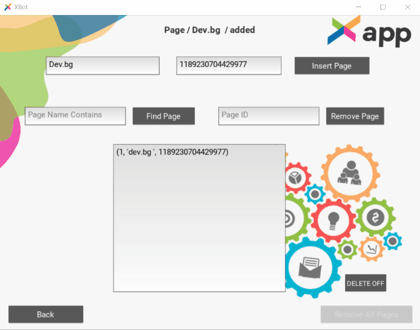

<h1 align="center">
  <br>
  <a href=""></a>
</h1>

<h4 align="center">Python-Kivy App for automated monitoring of competitor's Facebook ads.</h4>

<p align="center">
  <a href="https://img.shields.io/badge/Made%20with-Python-blue">
    
  </a>
  <a href="https://img.shields.io/tokei/lines/github/Bogo56/AdCapture_bot">
      
  </a>
  <a href="https://img.shields.io/github/languages/count/Bogo56/AdCapture_bot?color=f">
    
  </a>
  <a href="https://badgen.net/github/commits/Bogo56/AdCapture_bot">
    
  </a>
</p>

<p align="center">
  <a href="#about-the-project">About The Project</a> •
  <a href="#check-out-the-project">Check out the Project</a> •
  <a href="#project-workflow">Project Workflow</a> •
  <a href="#project-structure">Project Structure</a> 
</p>

## Built With
###  Languages
<p>
  
  
<p>
  
### Frameworks
<p>

</p>

### Databases
<p>

</p>

### Additional Libraries and Technologies
<p>
  
  
  
</p>

## About The Project
This is an app that is inspired by a **REAL-world scenario**, that we **had at the company** (Digital-Marketing company) I'm working at. The idea of it was to **automate some repetative tasks** that me and my colleagues had to do. The **goal of this app was to save some time for my team and increase it's productivity** by spending it on much more usefull tasks.

## Description of the problem
So basically Facebook has a section - (https://www.facebook.com/ads/library) - where anyone can see if a certain page currently has active ads and what they are. You can also filter your search by category, keywords, countries etc. A lot of times we needed to manually visit the page, make multiple screenshots for different competitors that a client has and then collect all those screenshots and send them on email to the client. Sometimes this was done a couple of times a week - loosing about 2-3 hours of productive time per person per month.

### And the Solution
I wanted to create a solution that would be usefull to all my teammates and not just myself. That's why a simple script was not enough. So i had to create an app that could be used by anyone and mainly non-coders. This is how I came up with this project. It basically visits every competitor, scrolls trough all the ads, makes a screenshot, generates a PDF from all screenshots in the end and sends it on email.

## How To Use
1. **Insert the Id's of the pages you would like to take screenshots of into the Database.**
       

2. **Add the email you'll be sending to.**
   - once inserted, the data is persisted in the app - so you don't have to configure it every time
     

3 **Choose your mode**
  * **Fully automated mode**
    - If all you want to do is scrape the competitor pages in the database and send the generated PDF to the client - just use this mode.
    
      
      
  * **Manual mode**
    - This is if you want to be more specific about the type of scraping that should be done - choosing a country, scroll depth, keyword searching, manually adding pages for single scraping.  
    
      
    
    
    - In this mode you can also make screenshots based on keywords insted of using specific pages.


## Project Workflow
Here, I'm outlining very briefly the phases that the project went trough from start to finish.

### Phase 1 - Manipulating the browser programatically - SELENIUM
First I needed a tool to automate browser navigation - this is where I used Selenium - one of the most popular libraries for software testing and browser automation. I used it to run Chrome in headless mode, which allowed me to resize the window a looot, and thus get all the ads in a single screenshot. I also used Selenium for navigation - clicking, closing, scrolling etc.
  
### Phase 2 - Resizing, compressing and combining all images into a single file - PILLOW
Next I had to compress the images, so that i can send them as attachments to an email, I also needed to reduce all scrrenshots to a single file - PDF seemed like the most appropriate type. So I used pillow, which made the whole process a breeze.

### Phase 3 - Persisting data - SQLite
I needed a way to store data - to achieve real automation. So I used SQlite because it's embedded and self-contained. Making it easy to be packaged inside the app.

### Phase 4 - Making the functionality available to people with no coding skills - KIVY
Now it was the time to create a real usable app out of all that functionality. I decided to use KIVY - since I had some previous experince with it. THe main perks were that it was possible to build a simple but intuitive interface and also to package the whole thing into a single executable file, so that others can use it on their PC. There are a lot of functionalities with this framework, which were quite handy.

### Phase 5 - Distributing the app - PyInstaller
I used PyInstaller to package all of the modules and files and make them executable through a single .exe file.


```
📦 RecipeApp
├─.gitignore
├─.idea
├─ README.md
├─ api_python
│  ├─ api.py
│  ├─ config.py
│  ├─ requirements.txt
│  ├─ resources
│  |  └─ routes.py
│  └─ seed
│     ├─ api_model.py
│     ├─ downloader.py
│     ├─ images
│     ├─ recipes.db
│     └─ scraper.py
├─ img
│  ├─ bookmark.png
│  ├─ bookmark_grad.png
│  ├─ check.png
│  ├─ clock.png
│  ├─ error.svg
│  ├─ favicon.png
│  ├─ icons.svg
│  ├─ logo.png
│  ├─ minus.png
│  ├─ notes_.png
│  ├─ people.png
│  ├─ plus.png
│  ├─ pngegg.png
│  ├─ recipe_4.jpg
│  ├─ sample_food.jpg
│  ├─ spin1.png
│  ├─ spin1.svg
│  ├─ spinner.png
│  └─ spinner.svg
├─ javascript
│  ├─ config.js
│  ├─ controller.js
│  ├─ errors.js
│  ├─ helpers.js
│  ├─ model.js
│  └─ views
│     ├─ bookmarksView.js
│     ├─ errorHandler.js
│     ├─ eventHandlers.js
│     ├─ loginView.js
│     ├─ recipeView.js
│     └─ searchView.js
├─ main.html
└─ style.css
```
©generated by [Project Tree Generator](https://woochanleee.github.io/project-tree-generator)

